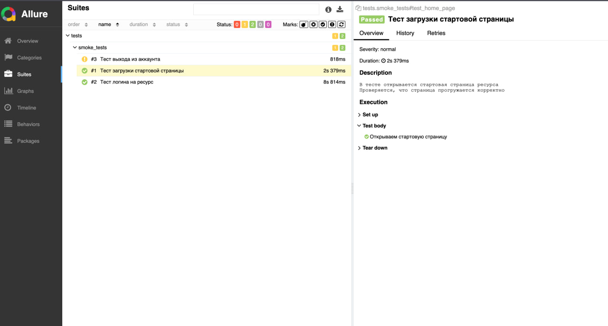

Здравствуйте!

Задание:
Перейти на главную страницу сайта  (https://numizmat-forum.ru/).
Проверить, что главная страница отображается корректно.
Найти и кликнуть на ссылку "Вход", чтобы перейти на страницу входа.
На странице входа ввести некорректные данные (например, "test" для имени пользователя и "test" для пароля) и нажать кнопку входа.
Проверить, что отображается сообщение об ошибке, указывающее на то, что введены неправильные данные для входа.
Ввести корректные данные для входа и нажать кнопку входа.
Проверить, что вы успешно вошли в систему и были перенаправлены на главную страницу.
Найти и кликнуть на ссылку "Выход", чтобы выйти из системы.
Проверить, что вы успешно вышли из системы и были перенаправлены на главную страницу.
В виртуальном окружении должен быть установлен фреймворк Pytest
Для запуска необходимо установить библиотеки из requirements.txt
Запуск осуществляется командой python3.11 -m pytest tests/smoke_test.py --alluredir allure
Для генерации отчета прописываем терминале allure serve allure/
Дальше переходим по ip:port, если веб сервер не открылся сам в браузере

Инструкция по запуску:
1. Установить на машину питон 
2. Создать venv, python3 -m venv venv, активировать
3. Установить в виртуальное окружение зависимости pip install -r requirements.txt
4. Запустить тесты из корня репозитория командой, pytest tests/smoke_tests.py --alluredir=allure
5. Дальше, если сервер с отчетом не поднялся сам, можно сделать самому allure serve allure/
6. Просмотреть отчет о прогоне

Так выглядит отчет

